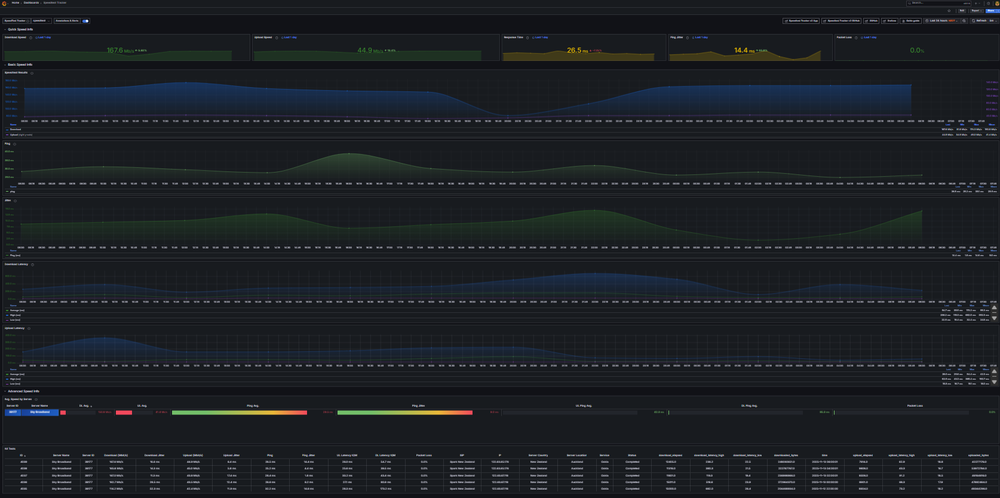

# Speedtest-Tracker-v2-InfluxDBv3-SQL
A dashboard to display data exported by Speedtest Tracker v2 using Influxdb v3 SQL as data source

This dashboard shows data collected by Speedtest Tracker v2 https://github.com/alexjustesen/speedtest-tracker and exported in an InfluxDB v3 database.

Dashboard based on the excellent work by [@masterwishx](https://github.com/masterwishx/Speedtest-Tracker-v2-InfluxDBv2).

Screenshot

